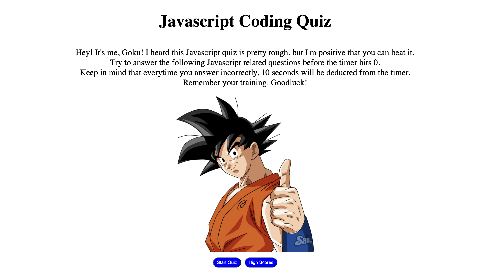

# Javascript-Quiz

## Description

Javascript quiz that tests a student's Javascript coding knowledge. App made using HTML, &amp; Javascript.

## Tool URL

https://omar4589.github.io/Javascript-Quiz/

## Usage

Need to practice your Javascript knowledge?
Use this site to take a Javascript related quiz!

Press the Start Quiz button to start the quiz.
When the quiz starts, a timer of 100 seconds starts and you are prompted with a javascript related question.
Select one of the choices underneath the question. If you choose the incorrect answer, 10 seconds will be subtracted from the timer.
If you answer correctly, you will move on to the next question.
After all questions are over, a results page will appear with your score.
Your score is the time left on the timer. Keep in mind that the timer can go on to negative numbers.
Enter your name in the input below your score result to record your name and score to the high scores page.

_You will need to refresh the page if you'd like to start the quiz all over again_

## Screenshot

  
    
## License
   
MIT License

Copyright (c) 2022 Omar4589

Permission is hereby granted, free of charge, to any person obtaining a copy
of this software and associated documentation files (the "Software"), to deal
in the Software without restriction, including without limitation the rights
to use, copy, modify, merge, publish, distribute, sublicense, and/or sell
copies of the Software, and to permit persons to whom the Software is
furnished to do so, subject to the following conditions:

The above copyright notice and this permission notice shall be included in all
copies or substantial portions of the Software.

THE SOFTWARE IS PROVIDED "AS IS", WITHOUT WARRANTY OF ANY KIND, EXPRESS OR
IMPLIED, INCLUDING BUT NOT LIMITED TO THE WARRANTIES OF MERCHANTABILITY,
FITNESS FOR A PARTICULAR PURPOSE AND NONINFRINGEMENT. IN NO EVENT SHALL THE
AUTHORS OR COPYRIGHT HOLDERS BE LIABLE FOR ANY CLAIM, DAMAGES OR OTHER
LIABILITY, WHETHER IN AN ACTION OF CONTRACT, TORT OR OTHERWISE, ARISING FROM,
OUT OF OR IN CONNECTION WITH THE SOFTWARE OR THE USE OR OTHER DEALINGS IN THE
SOFTWARE.
